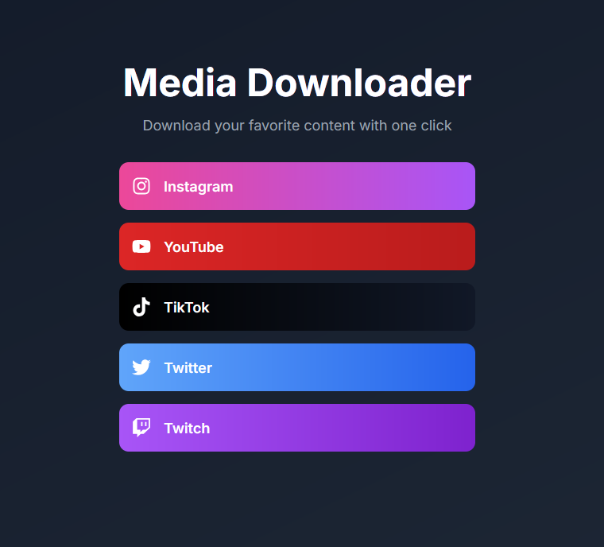
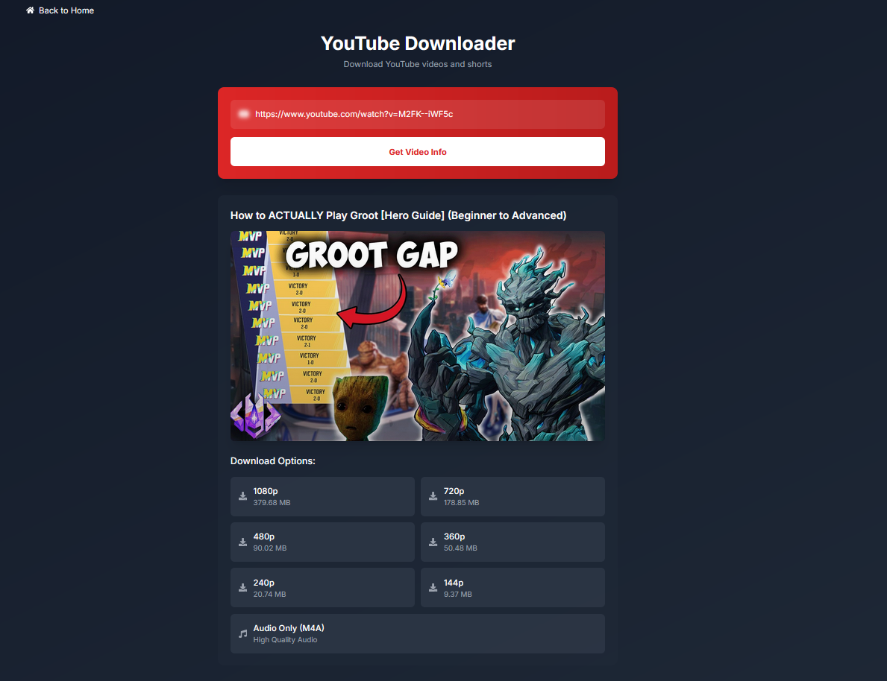

Social Media Downloader

A modern, user-friendly website that allows users to download media (videos, images, and audio) from various social media platforms by providing a link. The website analyzes the provided link and offers the appropriate download options.
Features

    Homepage with five main buttons:
        Instagram
        YouTube
        TikTok
        Twitter (X)
        Twitch

    Platform-specific functionality:
        For Instagram, download images or Reels videos.
        For YouTube, download regular videos or Shorts.
        For TikTok, download videos or images.
        For Twitter, download videos.
        For Twitch, download videos or profile pictures.

    Link analysis: The system analyzes the pasted link to determine the type of media (video, image, Reels, etc.) and allows users to download it accordingly.

    Preview: Users can preview the media before downloading.

Tech Stack

    Frontend:
        React
        Next.js
        Tailwind CSS

    Backend:
        Node.js with Express (or FastAPI if using Python)
        API integration for media extraction

    Libraries/Tools:
        Media download API (custom-built or third-party)
        Video/image preview library

License

This project is licensed under the MIT License.
Disclaimer

This tool is intended for educational and personal use only. Be sure to follow the terms of service for each social media platform when using this tool.
Screenshots

Here are some screenshots of the website:

